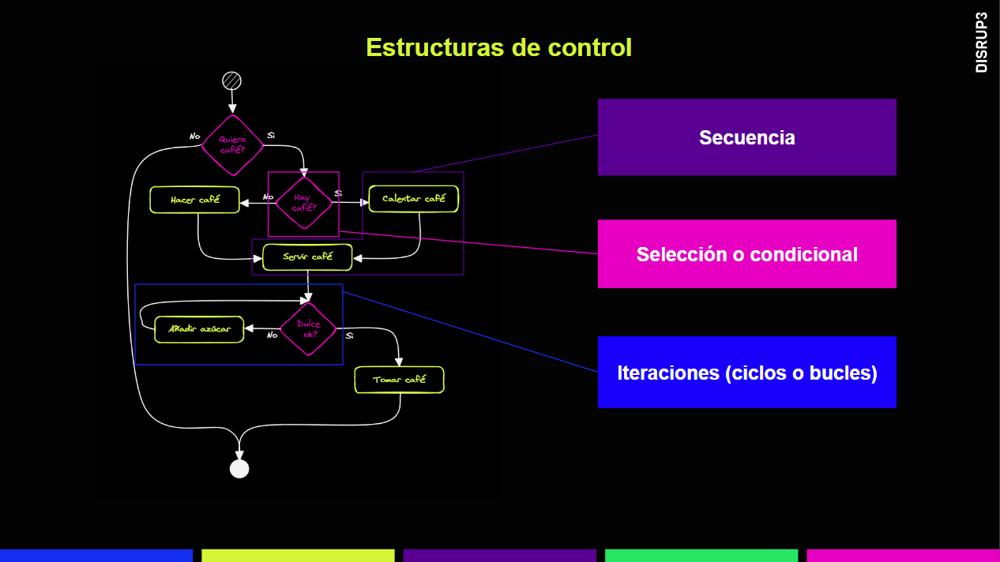
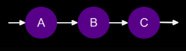
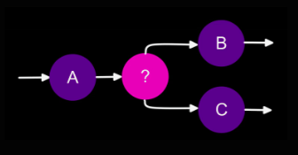
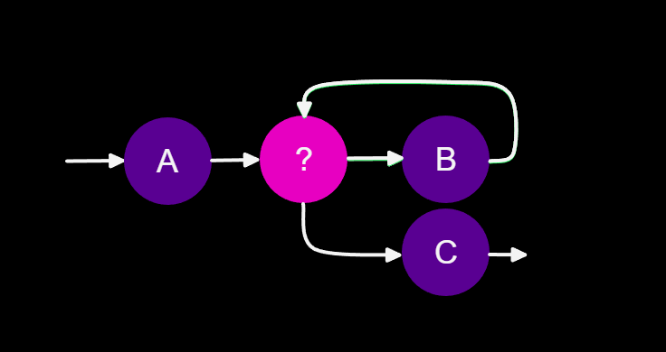

# Estructuras de control

## **¿Qué son las estructuras de control?**

Las estructuras de control son reglas que permiten controlar y cambiar el orden de ejecución de un programa. Son muy útiles en programación para tomar decisiones y repetir tareas varias veces.

Existen tres tipos principales de estructuras de control:

### **Secuencia**

Esta estructura indica que las tareas se ejecutan en orden secuencial, una después de la otra. Es decir, el programa sigue un flujo de ejecución directo y lineal.

### **Condicionales o bifurcación de flujo**

Estas estructuras permiten al programador tomar decisiones en función de una o varias condiciones. Se bifurcan el flujo del programa en diferentes direcciones según el resultado de la evaluación de las condiciones.

Por ejemplo, el **`if`** es una estructura condicional que permite ejecutar un bloque de código si se cumple una determinada condición, mientras que el **`else`** permite ejecutar un bloque de código si la condición del **`if`** no se cumple.

### **Bucles**

Los bucles permiten repetir una seccion de codigo varias veces. 

Hay tres tipos de bucles:

- **`for`**: se utiliza para repetir una tarea un número fijo de veces.
- **`while`**: se utiliza para repetir una tarea mientras se cumpla una determinada condición.
- **`do-while`**: se utiliza para repetir una tarea al menos una vez y luego seguir repitiéndola mientras se cumpla una determinada condición.

Es importante comprender las estructuras de control para poder crear programas más complejos y eficientes. Combinando estas estructuras podemos crear algoritmos más avanzados y efectivos.