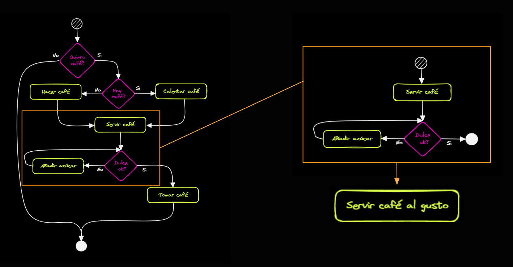

## Funciones en JavaScript

En programación, una función es un bloque de código que se puede reutilizar para realizar una tarea específica. En JavaScript, las funciones nos permiten agrupar instrucciones y ejecutarlas cuando sea necesario.



Algunos conceptos importantes sobre las funciones son:

### Definición de una función

Para definir una función en JavaScript, se utiliza la siguiente sintaxis:

```javascript
function nombreFuncion(parametro1, parametro2, ...) {
  // Código a ejecutar
}
```

- `nombreFuncion`: Es el nombre que le damos a la función y debe ser único dentro del contexto donde se define.
- `parametro1, parametro2, ...`: Son los valores que la función espera recibir para realizar su tarea. Estos son opcionales y pueden ser utilizados dentro de la función como variables.

### Llamada a una función

Una vez que hemos definido una función, podemos llamarla para ejecutar el código que contiene. La llamada a una función se realiza utilizando el nombre de la función seguido de paréntesis. Si la función espera parámetros, se deben proporcionar al llamarla.

```javascript
nombreFuncion(argumento1, argumento2, ...);
```

- `argumento1, argumento2, ...`: Son los valores reales que se pasan a la función al llamarla. Estos valores se asignan a los parámetros definidos en la función.

### Retorno de valores

Las funciones pueden devolver un valor utilizando la palabra clave `return`. Este valor puede ser utilizado posteriormente en el programa.

```javascript
function sumar(num1, num2) {
  var resultado = num1 + num2;
  return resultado;
}

var resultadoSuma = sumar(5, 3);
console.log(resultadoSuma); // Imprime 8
```

En el ejemplo anterior, la función `sumar` recibe dos parámetros y retorna la suma de los mismos. Al llamar a la función y asignar su resultado a la variable `resultadoSuma`, podemos utilizar ese valor posteriormente.

### Alcance de las variables en las funciones

Es importante tener en cuenta el alcance de las variables dentro de las funciones. En JavaScript, las variables declaradas dentro de una función tienen un alcance local, lo que significa que solo están disponibles dentro de esa función.

```javascript
function ejemplo() {
  let x = 10;
  console.log(x); // 10
}

ejemplo();
console.log(x); // Error: x is not defined
```

En este ejemplo, la variable `x` está declarada dentro de la función `ejemplo`. Solo se puede acceder a ella dentro de esa función. Si se intenta acceder a la variable `x` fuera de la función, se generará un error, ya que la variable no está definida en ese alcance.

### Beneficios de las funciones

Las funciones nos permiten:

- Reutilizar código: Podemos definir una función una vez y luego llamarla en diferentes partes del programa.
- Organizar el código: Las funciones nos ayudan a dividir el código en partes más pequeñas y manejables, lo que facilita su comprensión y mantenimiento.
- Evitar la repetición de código: Si hay una tarea que se realiza varias veces en el programa, podemos encapsularla en una función y llamarla en lugar de repetir el código.

Las funciones son una parte fundamental de la programación y permiten crear programas más estructurados y modulares.

## Detalles avanzados sobre funciones

> **Nota**: Esta sección contiene detalles avanzados sobre funciones que no son necesarios para continuar. Si deseas aprender más sobre este tema, puedes volver a esta sección más adelante.

### Funciones anónimas

En JavaScript, también es posible crear funciones anónimas, es decir, funciones sin nombre. Estas funciones se pueden asignar a variables o utilizarse directamente sin asignarlas a una variable.

```javascript
const saludar = function () {
  console.log("Hola, bienvenido");
};

saludar(); // Hola, bienvenido
```

En este ejemplo, se crea una función anónima y se asigna a la variable `saludar`. Luego, se invoca la función utilizando la variable `saludar`.

### Funciones flecha

En JavaScript, también existen las funciones flecha, una sintaxis más concisa y moderna para definir funciones. Se caracterizan por utilizar la flecha (`=>`) como parte de su sintaxis.

```javascript
const sumar = (a, b) => {
  return a + b;
};
```

En este ejemplo, se utiliza la función flecha para definir la función `sumar`, que recibe dos parámetros `a` y `b` y devuelve la suma de ambos. La declaración de la función es más concisa y el uso de la palabra clave `return` se puede omitir.

Si la función flecha tiene una sola expresión de retorno, se puede omitir el bloque de llaves y la palabra clave `return`, y la función devolverá automáticamente el valor de esa expresión.

```javascript
const multiplicar = (a, b) => a * b;
```

En este caso, la función `multiplicar` recibe dos parámetros `a` y `b` y devuelve el resultado de multiplicarlos. Al tener una única expresión de retorno, se puede escribir en una sola línea.

Las funciones flecha también tienen un comportamiento especial en cuanto al alcance de `this`. En una función flecha, `this` hace referencia al contexto léxico en el que se encuentra la función, mientras que en una función tradicional, `this` puede variar dependiendo de cómo se llame a la función.

```javascript
const objeto = {
  nombre: "Ejemplo",
  saludar: function () {
    setTimeout(function () {
      console.log("Hola, soy " + this.nombre); // Error: this.nombre is undefined
    }, 1000);
  },
};

objeto.saludar();
```

En este ejemplo, al ejecutar `objeto.saludar()`, se producirá un error porque `this.nombre` no está definido dentro de la función anidada en `setTimeout`. Para solucionar esto, se puede utilizar una función flecha en su lugar.

```javascript
const objeto = {
  nombre: "Ejemplo",
  saludar: function () {
    setTimeout(() => {
      console.log("Hola, soy " + this.nombre); // Hola, soy Ejemplo
    }, 1000);
  },
};

objeto.saludar();
```

Al utilizar una función flecha en lugar de la función anidada, `this.nombre` hace referencia al contexto de `objeto` y se puede acceder correctamente al valor de `nombre`.

### Conceptos adicionales

Al aprender JavaScript y las funciones, es importante tener en cuenta algunos conceptos adicionales:

- **Argumentos predeterminados**: Es posible asignar valores predeterminados a los parámetros de una función, lo que permite que la función se ejecute incluso si no se proporcionan todos los argumentos esperados.

- **Recursividad**: Una función puede llamarse a sí misma, lo que se conoce como recursividad. Esto puede ser útil para resolver problemas que se pueden dividir en subproblemas más pequeños.

- **Funciones de orden superior**: JavaScript permite el uso de funciones de orden superior, que son funciones que aceptan otras funciones como argumentos o devuelven funciones como resultado. Esto permite un estilo de programación más flexible y poderoso.

- **Clausuras**: Las clausuras son funciones que tienen acceso a variables externas incluso después de que la función externa haya finalizado su ejecución. Esto seconoce como "cierre" (closure) y es posible gracias al concepto de ámbito léxico en JavaScript. Las clausuras son útiles para crear funciones que mantienen acceso a variables privadas, lo que proporciona encapsulación y protección de datos.

- **Funciones de retorno de función**: En JavaScript, una función puede devolver otra función como resultado. Esto se conoce como función de retorno de función o función de orden superior. Esto es especialmente útil en casos donde se requiere crear funciones personalizadas basadas en ciertos parámetros o configuraciones.

- **Callbacks**: Los callbacks son funciones que se pasan como argumentos a otra función y se ejecutan en un momento determinado o cuando ocurre un evento específico. Los callbacks son ampliamente utilizados en JavaScript para manejar operaciones asíncronas, como solicitudes HTTP o eventos del usuario.

- **Funciones anidadas**: En JavaScript, es posible definir funciones dentro de otras funciones. Estas funciones anidadas tienen acceso al ámbito de la función externa y se utilizan comúnmente para encapsular lógica o variables dentro de un contexto específico.
